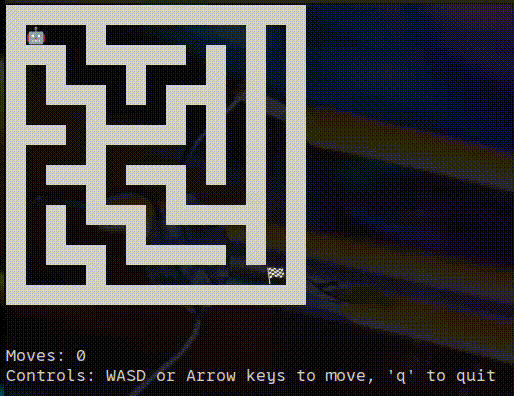

<div align="center">

# 🧩 Meiro

**Terminal-based maze generation & solving game**

[](https://github.com/k1-c/meiro/actions/workflows/ci.yml)
[](https://github.com/k1-c/meiro/releases)
[](LICENSE)
[](https://github.com/k1-c/meiro/releases)



_Navigate through algorithmically generated mazes with style 🎯_

</div>

## ✨ Features

🎮 **Interactive Gameplay** • Navigate with WASD or arrow keys  
🧠 **Multiple Algorithms** • Recursive Backtracking, Kruskal's MST, Prim's MST  
🎨 **Beautiful Rendering** • Unicode art with emoji characters  
⚡ **Lightning Fast** • Written in Haskell for optimal performance  
📦 **Zero Dependencies** • Single static binary, ready to run  
🌍 **Cross Platform** • macOS (Intel & Apple Silicon) and Linux support

---

## 🚀 Quick Start

### One-line Install

```bash
curl -fsSL https://raw.githubusercontent.com/k1-c/meiro/main/install.sh | bash
```

Or with custom install directory:

```bash
curl -fsSL https://raw.githubusercontent.com/k1-c/meiro/main/install.sh | MEIRO_INSTALL_DIR=~/.local/bin bash
```

### Command & Arguments

```bash
# Basic usage - start game with default settings
meiro

# Specify maze size (width x height)
meiro --size 30x20
meiro -s 50x50

# Choose algorithm
meiro --algorithm recursive    # Recursive Backtracking (default)
meiro --algorithm kruskal      # Kruskal's MST
meiro --algorithm prim         # Prim's MST
meiro -a kruskal              # Short form

# Combine options
meiro --size 40x30 --algorithm prim

# Help & version
meiro --help                   # Show help message
meiro --version                # Show version info
```

**Available Options:**

| Option | Short | Description | Default |
|--------|-------|-------------|---------|
| `--size WxH` | `-s` | Maze dimensions (width x height) | `30x15` |
| `--algorithm` | `-a` | Generation algorithm (`recursive`, `kruskal`, `prim`) | `recursive` |
| `--help` | `-h` | Show help message | - |
| `--version` | `-v` | Show version information | - |

---

## 🎯 How to Play

```
██████████████████████████████
██🏠    ██  ██              ██
██████  ██  ██  ██  ██████  ██
██      ██      ██  ██      ██
██  ██████████████  ██  ██████
██  ██              ██      ██
██  ██████  ██████████████  ██
██          ██          ██  ██
██████████████████  ██  ██  ██
██          ██      ██  ██  ██
██  ██████  ██  ██████████  ██
██  ██          ██          ██
██  ██████████████  ██████████
██                        🤖██
██████████████████████████████
```

**Controls:**

- `WASD` or `Arrow Keys` • Move around
- `Q` • Quit game

---

## 🔬 Algorithms

<details>
<summary><strong>🌿 Recursive Backtracking</strong> (Default)</summary>

- **Type**: Depth-First Search
- **Characteristics**: Creates long winding passages with high "river" factor
- **Performance**: O(n) time, O(n) space
- **Best for**: Classic maze feel with challenging paths

</details>

<details>
<summary><strong>🌊 Kruskal's Algorithm</strong></summary>

- **Type**: Minimum Spanning Tree
- **Characteristics**: Creates more open areas with shorter dead ends
- **Performance**: O(n log n) time, O(n) space
- **Best for**: Balanced difficulty with multiple solution paths

</details>

<details>
<summary><strong>🎯 Prim's Algorithm</strong></summary>

- **Type**: Minimum Spanning Tree (growing tree)
- **Characteristics**: Creates dense branching with organic growth patterns
- **Performance**: O(n log n) time, O(n) space
- **Best for**: Compact mazes with natural-looking structures

</details>

---

## 🏗️ Architecture

Built with modern Haskell practices:

```
src/
├── Meiro/
│   ├── Types.hs              # Core data types
│   ├── Utils.hs              # Utility functions
│   ├── Rendering.hs          # Terminal rendering
│   ├── Gameplay.hs           # Game logic & input
│   └── Algorithms/
│       ├── RecursiveBacktrack.hs
│       ├── Kruskal.hs        # Union-Find implementation
│       └── Prim.hs           # Set-based algorithm
```

**Tech Stack:**

- **Language**: Haskell with GHC 9.10
- **Build System**: Stack
- **Dependencies**: Minimal (only base libraries)
- **Testing**: Hspec + QuickCheck
- **CI/CD**: GitHub Actions

---

## 🛠️ Development

### Prerequisites

- [Stack](https://docs.haskellstack.org/en/stable/README/)
- GHC 9.10.2

### Build from Source

```bash
git clone https://github.com/k1-c/meiro.git
cd meiro

# Development build
stack build

# Run tests
stack test

# Build optimized binary
stack build --copy-bins --local-bin-path ./dist
```

### Contributing

We welcome contributions! Please see [CONTRIBUTING.md](docs/CONTRIBUTING.md) for guidelines.

---

## 📊 Performance

| Metric       | Value           |
| ------------ | --------------- |
| Binary Size  | ~4MB            |
| Memory Usage | <10MB           |
| Startup Time | <100ms          |
| 50x50 Maze   | <1ms generation |

---

## 🎨 Customization

Meiro supports custom rendering styles through the `CellStyle` configuration:

```haskell
customStyle = CellStyle
    { wallChar   = "██"
    , pathChar   = "  "
    , startChar  = "🏠"
    , goalChar   = "🏁"
    , playerChar = "🤖"
    }
```

---

## 📋 System Requirements

**Supported Platforms:**

- macOS 10.15+ (Intel & Apple Silicon)
- Linux x86_64 (Ubuntu 18.04+, etc.)

**Requirements:**

- Terminal with Unicode support
- 4MB free disk space
- 10MB RAM

---

## 📜 License

This project is licensed under the MIT License - see the [LICENSE](LICENSE) file for details.

---

<div align="center">

**Made with ❤️ in Haskell**

[Report Bug](https://github.com/k1-c/meiro/issues) • [Request Feature](https://github.com/k1-c/meiro/issues) • [Contribute](docs/CONTRIBUTING.md)

</div>
